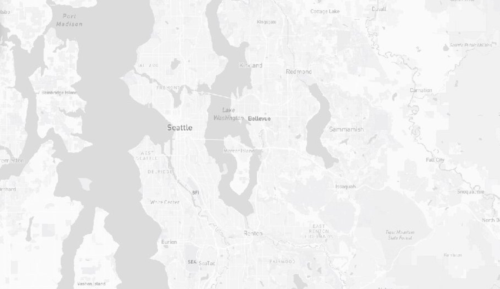
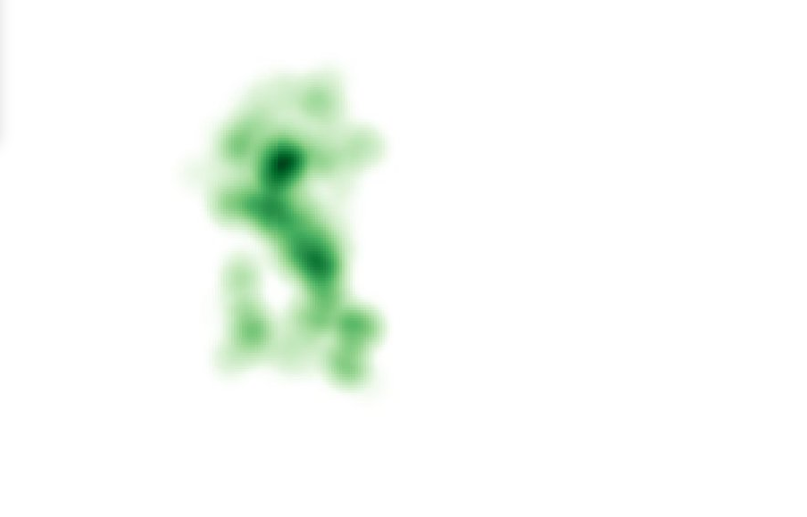
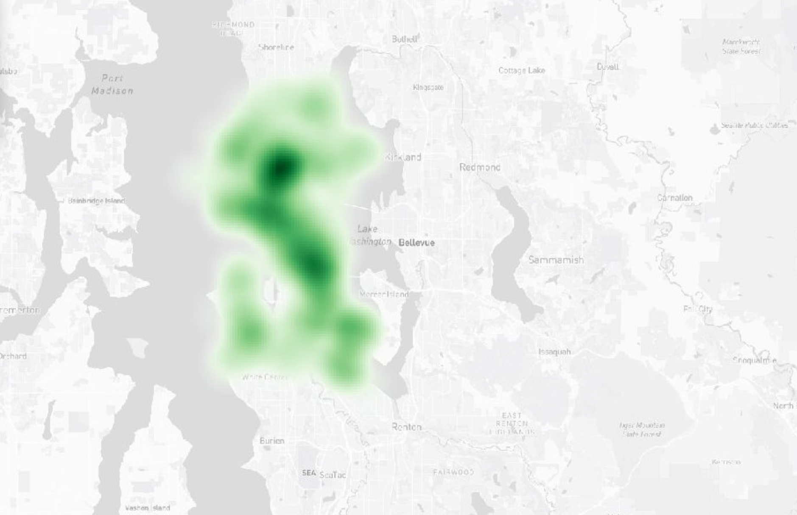
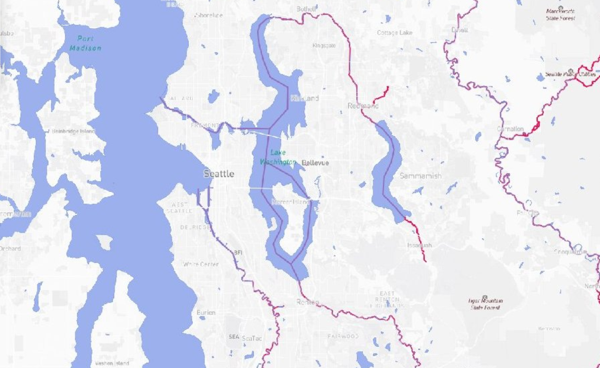

## Web map link

URL: https://github.com/hieut01/mapbox_tiles_lab4

## What this project is

This lab shows how raster tiles exported from QGIS (saved as `{z}/{x}/{y}.jpg`) can be loaded into a Mapbox GL JS web map. The final map is full screen and includes a layer switcher to compare four different tile sets of Seattle.

## Examined area

Seattle, Washington (city focus).

## Zoom levels

All tile sets use zoom levels 10–14.

## Tile set 1: Basemap

A regular basemap of Seattle used for geographic context.

## Tile set 2: Thematic map

A thematic map showing water fountains in the city.

## Tile set 3: Combined map – Basemap + fountains

A combined map that includes the basemap plus the fountain layer together.

## Tile set 4: Mapbox theme – Waterline + landmarks

A themed map focused on Seattle’s waterline, plus landmark locations shown with a camera icon.

## Short story for tile set 4

Tile set 4 is meant to feel like a simple Seattle waterfront tour. The waterline gives the map its main shape and helps you stay oriented, then the camera icons mark places that feel worth stopping at. It is less about being a reference map and more about highlighting the parts of Seattle that connect back to the shoreline.
